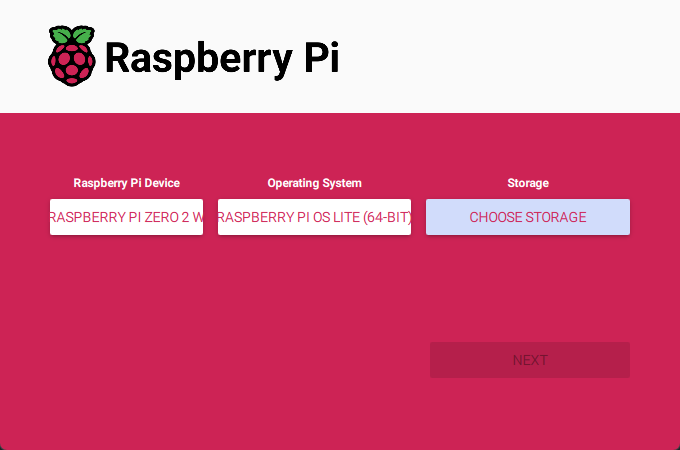

# MechaTag - Apriltag localization for MechaLeague and small robots.

Apriltag localization for MechaLeague and small robots. MechaTag is a smart camera and software suite based on the Raspberry Pi Zero 2w, made to localize MechaLeague robots on the field

# Setup

### 1. Flash Raspberry Pi OS Lite (Bookworm)
Using [Raspberry Pi Imager](https://www.raspberrypi.com/software/), flash Raspberry Pi OS Lite (Bookworm) 64-bit to a 16GB or more micro SD card



**Why Bookworm and not Bullseye?** The library used my mechatag to scan apriltags (robotpy-apriltag) only has a precompiled version for glibc 2.36+ and Python 3.11, both of which Bookworm complies with but Bullseye doesn't.

### 2. Clone the repository
First install git with this command:
```sh
sudo apt update && sudo apt install git -y
```
Then clone this repository with git :
```sh
git clone <repo_url>
```

### 3. Install dependencies
Install debian packaged dependencies:
```sh
sudo apt install python3-flask python3-opencv python3-picamera2
```

Create a virtual environment for the project
```sh
python3 -m venv --system-site-packages .venv
```

Activate virtual environment
```sh
source .venv/bin/activate
```

Install apriltag detector
```sh
pip install robotpy-apriltag
```

### 4. Run main.py in venv
```sh
python3 ./src/main.py
```